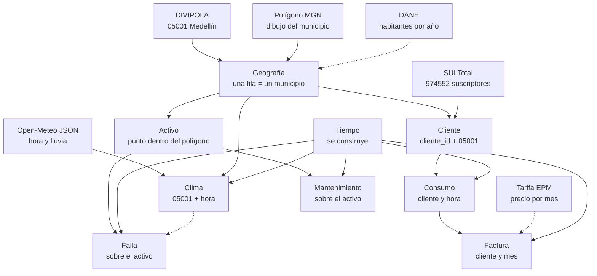
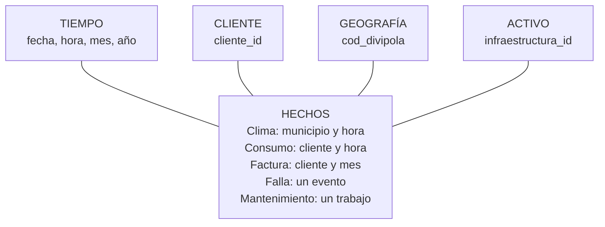
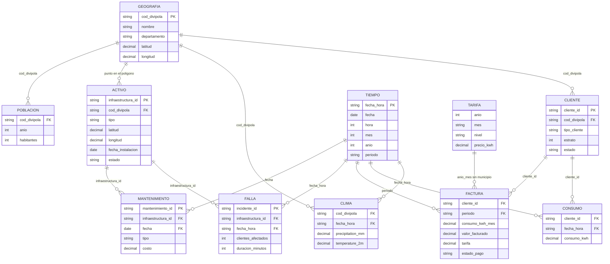

# Modelo estrella — primer corte Medellín

Cómo se construye, en qué archivo real se basa cada caja, y cómo se relacionan.

Este corte es **Medellín**, código DIVIPOLA `05001`, **enero de 2021**, ubicación **Total** (urbano más rural). El mapa de códigos puede seguir siendo Antioquia. Las filas finas del primer modelo nacen en esta ciudad.

Para ver los dibujos hay que abrir este archivo en GitHub, o en una vista que renderice Mermaid. En el editor de texto solo se ve el código del diagrama.

## En una frase

DIVIPOLA dice que Medellín es `05001`. Todo lo demás se cuelga de ese código, de un cliente o de un activo. Lo que no trae código de municipio se queda al lado y no entra al centro de la estrella.

## En qué nos basamos

| Pieza del modelo | Archivo en `muestras/` | Qué tomamos de ahí |
|---|---|---|
| Geografía | `DIVIPOLA-_Códigos_municipios_20261007.csv` | `Código Municipio` = `05001`, nombre MEDELLÍN, latitud y longitud de la cabecera |
| Polígono | carpeta `MGN2025_MPIO_GRAFICO/` | El dibujo del municipio. El código va en `MPIO_CDPMP`. Sirve para ubicar un poste, no para pedir el clima |
| Clima | `open_meteo_archive.json` | Hora en `time` (`2024-01-01T18:00`) y lluvia en `precipitation`. El JSON no trae `05001`; se lo escribimos al guardar |
| Suscriptores | `reporte (1).csv` | EPM, Medellín, enero 2021, Total. Cuántos usuarios hay por estrato y por tipo. No es la lista de personas |
| Precio | `Histórico_de_Tarifas_de_Energía_Eléctrica_–_EPM_(2016-2021)_20261007.csv` | Precio del kWh por año y mes. No trae municipio ni consumo medido |
| Habitantes | `PPED-AreaMun-2018-2042_VP.xlsx` | Personas estimadas por municipio y año. No es el número de clientes |
| Suscriptores urbano, aparte | `reporte.csv` | La misma consulta, solo urbano. No se suma con el Total |
| No entran | `gw2d-7n7y.csv`, `endg-udcv.csv` | Facturas de Codensa y usuarios de Cali. No son EPM ni `05001` |

Números del archivo Total, enero 2021, Medellín, EPM:

| Grupo | Usuarios |
|---|---|
| Estrato 1 | 124.499 |
| Estrato 2 | 298.980 |
| Estrato 3 | 254.421 |
| Estrato 4 | 100.876 |
| Estrato 5 | 71.949 |
| Estrato 6 | 38.816 |
| Total residencial | 889.541 |
| Industrial | 7.110 |
| Comercial | 75.571 |
| Oficial | 1.814 |
| Otros | 516 |
| Total no residencial | 85.011 |
| Total de suscriptores | 974.552 |

Esos 974.552 son el tamaño real de la ciudad. En el primer corte no se crean 974.552 clientes hora por hora. Se crea una muestra que respeta esas proporciones.

## Cómo se construye

Primero el lugar. Después lo público que se le puede pegar. Al final se inventa la empresa.

La línea punteada no es una llave de fila a fila. La población se muestra junto al municipio. La tarifa solo pone el precio del mes. El clima se compara con las fallas después de contarlas, no se copia dentro de cada falla.

## La estrella

El centro mide. Alrededor dice quién, cuándo, dónde y sobre qué activo.

Relaciones con las llaves reales:

`TARIFA` no tiene `cod_divipola`. Se une a la factura solo por año y mes, como precio de EPM, no como dato de una ciudad.

## Qué lleva cada tabla

**Geografía.** Una fila, un municipio. Sale del DIVIPOLA. Medellín: `05001`. El polígono se pega a ese mismo código. El nombre no se usa para cruzar.

**Tiempo.** No se descarga. Se construye el calendario del corte: fecha, hora, mes, año y periodo `2021-01`. El clima usa fecha y hora. La factura y la tarifa usan el mes.

**Cliente.** Se genera. `cliente_id` y `cod_divipola = 05001`. El tipo y el estrato salen de las proporciones del SUI. Ejemplo: de 974.552 suscriptores, 889.541 son residenciales y el estrato 2 es el más grande (298.980).

**Consumo.** Se genera. Una fila es un cliente en una hora: `cliente_id`, fecha, hora, `consumo_kwh`. No lleva la ciudad. Llega a Medellín porque el cliente tiene `05001`. El kWh de la hora no está en ningún archivo bajado.

**Factura.** Se calcula. Se suman las horas de ese cliente en el mes. Esa suma es el kWh del mes. El precio se busca en la tarifa EPM de ese año y mes. También se anota si pagó. El kWh de las 18:00 y el kWh del mes no se suman juntos: el del mes ya incluye la hora.

**Activo.** Se genera. Transformador, poste, línea, subestación o protección. Lleva latitud y longitud. Esas coordenadas tienen que caer dentro del polígono de `05001`. Ahí recibe el código.

**Falla.** Se genera sobre un activo, así que hereda Medellín. Para ver si llovió se arman dos filas con la misma llave `05001` + fecha + hora: una con la lluvia, otra con el conteo de fallas. La lluvia no se escribe dentro de cada falla.

**Mantenimiento.** Se genera. Un trabajo sobre un activo, con fecha, tipo y costo. La ciudad sale del activo.

**Clima.** Una fila es `05001` en una hora. Los campos salen del JSON: `time`, `precipitation`, `temperature_2m`. La muestra actual es del 1 al 7 de enero de 2024, no de enero de 2021. Sirve para ver la forma del archivo. Para cruzar con enero de 2021 hay que pedir ese mes a Open-Meteo.

**Población.** Una fila es `05001` en un año. Habitantes. No se crean clientes a partir de esas personas.

**Tarifa.** Una fila es un precio de EPM en un año y un mes, por nivel y tipo. No tiene municipio.

## Un cliente, para ver las llaves

`C1` vive en Medellín. `T1` es su transformador.

| Tabla | Fila | Cómo se sabe que es Medellín |
|---|---|---|
| Cliente | `C1`, `05001`, estrato 2 | El código va en la fila |
| Consumo | `C1`, 2021-01-15 18:00, 1,2 kWh | Se busca `C1` y se lee `05001` |
| Factura | `C1`, periodo 2021-01, kWh del mes, precio EPM | Se busca `C1`. El precio se busca por enero 2021, no por ciudad |
| Activo | `T1`, punto dentro del polígono | El punto cae en `05001` |
| Falla | `F1`, activo `T1`, esa hora | `T1` ya es `05001` |
| Clima | `05001`, esa hora, lluvia en mm | El código se escribió al guardar el JSON |
| Población | `05001`, 2021, habitantes | Misma ciudad, otro tema. No es `C1` |

## Qué no se cruza

| Intento | Por qué se queda fuera |
|---|---|
| Unir por el texto MEDELLÍN | En el SUI el nombre puede perder la tilde. La llave es `05001` |
| Pegar la tarifa a un municipio | El CSV de precios no trae código de ciudad |
| Pegar Codensa o Cali a `05001` | Son otra empresa y otra ciudad |
| Sumar el CSV urbano con el Total | El urbano ya va dentro del Total. Se usa solo `reporte (1).csv` |
| Crear un cliente por cada habitante | El DANE cuenta personas. El SUI cuenta cuentas de energía |
| Sumar la lluvia sobre cada falla | La misma lluvia se contaría una vez por falla |
| Sumar el kWh de la hora con el de la factura | El del mes ya es la suma de las horas |

## Orden para generarlo, cuando el polígono esté completo

1. Cargar municipios. Dejar Medellín como `05001`.
2. Pegar el polígono a ese código.
3. Construir el calendario de enero 2021, hora por hora.
4. Pedir el clima de esa cabecera para enero 2021 y escribirle `05001`.
5. Guardar habitantes de `05001` en 2021, al lado.
6. Guardar la tarifa EPM de enero 2021, al lado.
7. Crear una muestra de clientes con las proporciones del SUI, todos con `05001`.
8. Crear el consumo de cada cliente, cada hora de ese mes.
9. Crear la factura sumando el mes y aplicando la tarifa.
10. Crear activos con un punto dentro del polígono.
11. Crear fallas y mantenimientos sobre esos activos.

Hoy se puede dejar escrita la estrella. Las filas del activo esperan a que en `MGN2025_MPIO_GRAFICO/` estén el `.shp`, el `.dbf` y el `.shx`, no solo los archivos de apoyo.
